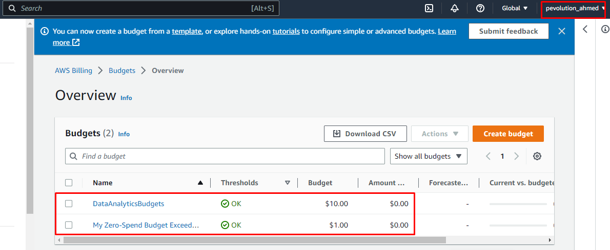

# Week 0 — Billing and Architecture

## Learned to use Lucidchart to create Architecual diagrams

[sharable link](https://lucid.app/lucidchart/39b1014b-bd1a-4784-b158-4ba6adfbaa83/edit?viewport_loc=149%2C70%2C1997%2C876%2C0_0&invitationId=inv_8d4887f6-7b5e-4b41-b42d-cc891e2b50ca)

## Setting up AWS CLI on Gitpod

## Setting up billing Alarms and Budgets

