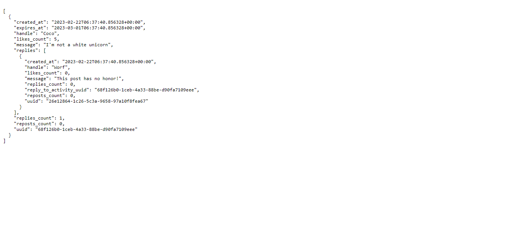

# Week 1 — App Containerization

## Add env vars to the container
- Add the environment vars to your local develoment environment aka (your command line interface)
- Pipe the environment variables from your CLI to The Container using the following command
    - ``` docker run --rm -p 4567:4567 -it -e FRONTEND_URL -e BACKEND_URL backend-flask```
    - or exceplicitly specify them as follows:``` docker run --rm -p 4567:4567 -it -e FRONTEND_URL='*' -e BACKEND_URL='*' backend-flask```
## Checked the two Docker containers for react and flask is working or not?

**Ports is working**


**CRUDDER is working also ^^**


---

## Followed the Add Notifications Features Video

**Backend result**


**Frontend result**


## Add dynamodb and postgresql containers to docker-compose

- Do an *npm install* at the **frontend-react-js** folder if you don't already,  or it'll give an error when we try to run the front-end docker container container
- Then add **dynamodb** and **postgress** services into docker-compose file ( as mentioned in the video)
- Run ```docker-compose up``` and wait until every container is setuped correctly
- Check the 4 ports is working as the mapping below 
    - **3000** -> frontend
    - **4567** -> backend
    - **8000** -> dynamodb
    - **5432** -> postgres
    - 

